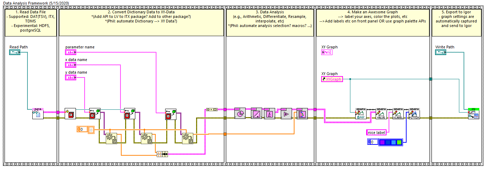

# Data Analysis Framework

Data Analysis Framework is a template (simple-LevyLab Analysis Framework (Template).vi) based on a JKI State Machine that demostrates how to construct an analysis VI from the following existing packages:

- [JKI State Machine](https://github.com/JKISoftware/JKI-State-Machine): program architecture
- [LV to ITX](https://github.com/levylabpitt/LV-to-ITX): read/write data files; export graphs to Igor
- [XY Utilities](https://github.com/levylabpitt/xy_utilities): utilities for working with XY-data type
- [Graph Utilities](https://github.com/levylabpitt/graph_utilities): utilities for generating and formatting graphs

## Outline

Basic use (sequence frames represent states or multiple states in a JKI State Machine):

## Contributing
Please contact [Patrick Irvin](https://github.com/ciozi137)

## License
[BSD-3](https://opensource.org/licenses/BSD-3-Clause)
